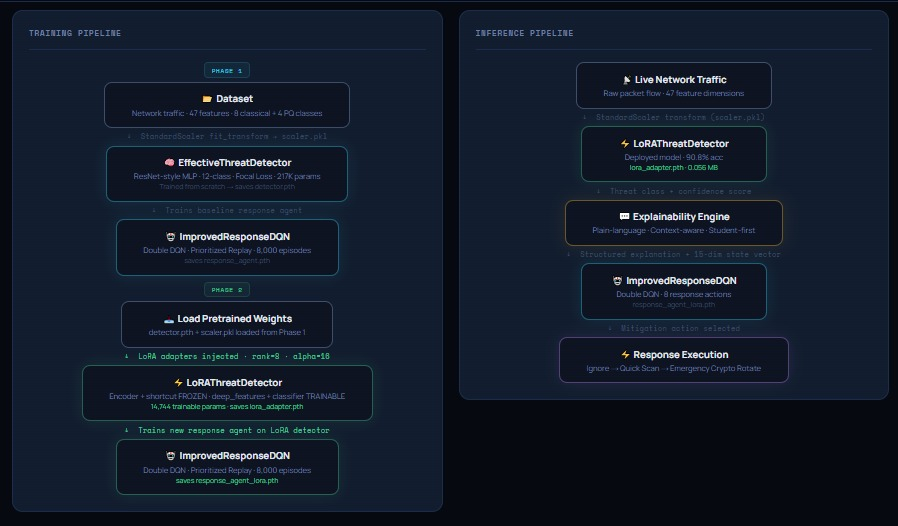

# Digital Hygiene - Post-Quantum Cybersecurity Defense System

> **AMD AI Cybersecurity Hackathon** . Research Prototype . 2026

---

## Executive Summary

**Digital Hygiene** is an AI-based, explainable cybersecurity defense system designed specifically to educational institutions and can be extended to any organization with long term sensitive data. This is not just a detection system it is a decision making cybersecurity agent.

It integrates three synchronized layers: a ResNet-based threat detector (12 classes with 4 of them post-quantum threat-related), a Deep Q-Network response agent, which chooses the mitigation actions on-the-fly, and a LoRA-fine-tuned variant, **which is even more accurate with only 7.9% trainable parameters.**

In contrast to traditional signature-based IDS tools, Digital Hygiene is plainly written on why something is dangerous, its response strategy adjusts according to the changing threat confidence, and is even designed to respond to the quantum threat that most institutions are not yet contemplating.It prevents long-term academic data breaches in universities.

**Key results at a glance:**
- 90.80% overall detection accuracy (LoRA model)
- 89.64% post-quantum threat detection accuracy (+6.72% over baseline)
- 98.61% correct response selection for PQ threats
- Adapter file: 0.056 MB - 13x smaller than the full model

---

## Why This Beats Traditional IDS

| Capability | Signature-based IDS | Rule-based ML IDS | Digital Hygiene |
|---|---|---|---|
| Novel threat detection | No requires known signatures | Limited to training distribution | Yes generalizes via learned features |
| Post-quantum threat awareness | No not designed for it | No PQ taxonomy | Yes 4 dedicated PQ threat classes |
| Adaptive response | No static rule mapping | No fixed thresholds | Yes  RL agent learns optimal actions |
| Plain-language explanation | No raw alerts | No technical logs | Yes student-first explainability layer |
| Lightweight deployment | Varies | Varies | Yes 0.056 MB LoRA adapter |
| Domain adaptation | No full retrain required | No full retrain required | Yes LoRA fine-tuning, 92% frozen |

---

## The Story

It began with a discussion that most individuals never consider until it is their time.

Suppose that a first year student named Cipher is sitting in a university computer laboratory, clicking on what appears to be a normal e-mail message by the registrar office. The link looks right, the logo appears fine. 48 hours after, his login information is being sold on a paste site which he has never heard of. His school performance has been seen. His application to scholarship is lost. He didn't do anything wrong. He just didn't know.

And use that number times tens of thousands of students who enter laboratories, open links, upload files using open Wi-Fi, and believe that when there is encryption of a connection, it is secure. They're not careless. They're just not equipped.

It is the gap we have attempted to bridge.

---

## The Problem


These threats are not abstract, such as Phishing, malware, spoofing, and data misuse. They attack students, laboratories and institutions on a daily basis and anti-hacking devices created to prevent it are either unknown to the people who require them most or so advanced that they cause warning bells that no one sees.

And then there exists the second layer that everyone is not much discussing but the **post-quantum** threat. The actions of nation-state actors and advanced adversaries have already launched the campaigns of Harvest Now, Decrypt Later (HNDL), i.e., harvesting encrypted traffic today and intending to decrypt them when quantum computers are ready enough. In the case of institutions that have access to long-term research data, medical records, or PII of students, the threat is real.

**Specific pain points:**

-No layman, real-time, explanation of why something is harmful.

-There is no adaptive system that becomes better with the development of threats.

-None of the awareness layers installed on students, first-year users not only security teams.

-No preparation of post-quantum cryptographic attacks and data silently gathering today.

---

## The Solution: Digital Hygiene

Digital Hygiene is a layered AI defense system.

**The first layer** is the EffectiveThreatDetector a ResNet-style MLP that is trained on 12 threat classes both based on classical network attacks (DDoS, DoS, brute force, spoofing, Mirai/IoT botnet, web-based attacks, reconnaissance, and benign traffic) and four post-quantum threat types (PQ-Downgrade, PQ-HNDL, PQ-SideChannel, and PQ-Hybrid). It works in real time with a live network traffic and displays a threat class and confidence score.

**The second layer** is the Explainability Engine plain-language, context-aware, student-first module that receives the threat class and confidence score of the detector and generates a structured explanation and a 15-dimensional state vector encoding threat class, confidence level, system health and cryptographic strength.

**The third layer** is the ImprovedResponseDQN which is a reinforcement learning response agent that was trained using Double DQN and prioritized experience replay over 8,000 simulated threat events. It takes the 15-dim state vector at the Explainability Engine and chooses the suitable mitigation measure.

**The fourth layer** is Response execution, where the chosen mitigation measure is implemented, which may be an Ignore of non-malicious traffic, a Quick Scan or Full Scan, up to the Network Isolate, PQ-Crypto Upgrade, and Emergency Crypto Rotate responses to the most serious post-quantum threats.

**LoRA Fine-tuned Detector** (upgrade to Layer one) does not represent a distinct pipeline stage, but instead a much more parameter-efficient replacement of the baseline detector. It also uses the baseline pretrained weights as an input, freezes the encoder and residual shortcut, and only trains the deep features, classifier head, and lightweight LoRA adapter matrices (only 7.9% of the total parameters -14,744 trainable). On top of this fine-tuned detector a separate response agent is then trained. It is the best to use in domain adaptation between institutions without the need to retrain completely with the 0.056 MB adapter file.


---

## Design Decisions - Answering the Hard Questions

### Why Synthetic Post-Quantum Threat Data?

There is no public labeled dataset for post-quantum network-level attacks because these attacks are either classified, not yet widely executed, or not yet captured in PCAP-level telemetry. This is an industry-wide gap, not a project limitation.

Our synthetic generation applies class-specific feature perturbation patterns to samples drawn from the classical threat distribution:

| PQ Threat Class | What the Code Does | Intended to Approximate |
|---|---|---|
| **PQ-Downgrade** | Scales down 25% of features by 0.3-0.6x; spikes 10% of features by +1.5 to +2.5 | Weakened cryptographic negotiation signatures alongside anomalous handshake activity |
| **PQ-HNDL** | Amplifies 33% of features by 1.8-2.5x; applies sine modulation to 12% of features | High-volume sustained collection behavior with oscillating inter-arrival patterns |
| **PQ-SideChannel** | Binary scaling of 33% of features to either 0.4x or 2.0x; adds uniform noise to 17% of features | Bimodal timing bursts characteristic of key schedule observation attempts |
| **PQ-Hybrid** | Scales down 25% of features and scales up a different 25%; mean-centers 17% of features | Combined downgrade and volume anomaly signatures from hybrid attack scaffolding |

All generated samples receive small Gaussian noise (mean=0, std=0.05) and are clipped to [-3, 4] to stay within the feature distribution range. Each PQ class uses a distinct perturbation pattern across the 39-feature schema to ensure separability for the detector.

We acknowledge this is a pattern-injection approximation, not a protocol-faithful simulation. We simulated PQ threats because real world dataset don't exist yet making this system future ready.Feature indices transformed are randomly sampled rather than mapped to named protocol fields. Production deployment would benefit from collaboration with network security labs capable of generating or labeling real PQ-adjacent traffic against known feature schemas. This is explicitly listed in future work.

---

### Why Reinforcement Learning Instead of Rule-Based Response?


Rule based system fail under uncertainty. Our RL agent is designed specifically for this:

**Scenario A:** The system health is nominal, and Quick Scan is accurate with a 97% confidence level.
**Scenario B:** recon found, confidence 54, weakened crypto strength, recent PQ flag enabled -> Full Scan or PQ-Crypto Upgrade can be justified; Quick Scan is probably insufficient.

The rule based approach maps threat class action. The RL agent is (threat class x confidence x system health x crypto strength x PQ context) action. The response decisions that such a 15-dimensional state space generates cannot be reproduced by a fixed rule table without listing thousands of conditional branches and still would not generalize to unknown confidence distributions.

The Double DQN  and Prioritized Experience Replay specifically focuses on the issue of Q-value overestimation in naive DQN in sparse-reward security settings. The prioritized replay makes sure that the agent will learn disproportionately on rare high-stakes events (PQ threats, low-confidence high-severity detections) the authentic tail cases where rule-based systems fail to detect anything.

**Empirical validation:** RL agent selection correct response on 98.61% of PQ threats the category that had to be generalized to using only a limited amount of training samples. The rule-based system would score 100% on seen and 0% on novel combination. The RL agent sacrifices perfect recall of the known cases to achieve strong generalization of the unknown cases.

---

### How Scalable Is This?

| Dimension | Answer |
|---|---|
| **Model size** | 0.87 MB baseline; 0.056 MB LoRA adapter deployable on edge hardware |
| **Inference speed** | CPU inference at 4 cores / 8 GB RAM; GPU optional suitable for lab-scale real-time use |
| **Multi-institution adaptation** | LoRA fine-tuning requires only 7.9% parameter updates a new institution can adapt the model to its traffic profile without sharing raw data (federated learning extension planned) |
| **Dataset scale** | Trained on CIC-IoT 2023 a large-scale, heterogeneous IoT/network dataset covering 12 traffic classes |
| **API surface** | Flask REST API with `/predict` and `/model_info` endpoints integrable with SIEM, SOC dashboards, or browser extensions |
| **Extensibility** | New threat classes can be added by extending the softmax head and fine-tuning via LoRA no full retrain required |

Current limitation: real-time PCAP stream ingestion is not yet implemented (Scapy/DPDK integration is listed in future work). The current system operates on pre-extracted 39-feature flow vectors, consistent with standard NetFlow/IPFIX telemetry pipelines.

---

## Results

### Baseline Model

| Metric | Score |
|--------|-------|
| Overall Detection Accuracy | 89.20% |
| F1-Score (weighted) | 0.890 |
| Response Accuracy | 88.10% |
| PQ Detection Accuracy | 82.93% |
| PQ Response Accuracy | 96.65% |
| Average Detection Confidence | 79.9% |
| Average RL Reward | 49.71 |
| Total Parameters | 217,890 |
| Model Size | 0.87 MB |

### LoRA Fine-tuned Model

| Metric | Baseline | LoRA | Delta |
|--------|----------|------|---|
| Detection Accuracy | 89.20% | **90.80%** | +1.60% |
| PQ Detection Accuracy | 82.93% | **89.64%** | +6.72% |
| Response Accuracy | 88.10% | **90.20%** | +2.10% |
| PQ Response Accuracy | 96.65% | **98.61%** | +1.96% |
| F1-Score | 0.890 | **0.906** | +0.016 |
| Trainable Parameters | 185,970 (100%) | **14,744 (7.9%)** | 92.1% frozen |
| Adapter Size | 0.87 MB | **0.056 MB** | 13x smaller |

---

## Technical Architecture

### System Pipeline




### Detection Model - EffectiveThreatDetector

- **Architecture:** ResNet-style MLP with skip connections
- **Input:** 39-feature normalized network flow vector (StandardScaler)
- **Layers:** 256 -> 256 (residual) -> 192 -> 128 -> 64 -> 12 (softmax)
- **Regularization:** BatchNorm1d, Dropout (0.15-0.3), gradient clipping (1.0)
- **Loss:** Weighted Focal Loss (y=2.0) for class imbalance
- **Optimizer:** AdamW (lr=0.001, weight_decay=1e-4)
- **Training:** 100 epochs, batch 256, early stopping (patience=35)

### Threat Classes

| ID | Class | Category |
|----|-------|----------|
| 0 | Benign | Normal Traffic |
| 1 | DDoS | Distributed Denial of Service |
| 2 | DoS | Denial of Service |
| 3 | Recon | Reconnaissance/Scanning |
| 4 | Web-based | Web Application Attack |
| 5 | BruteForce | Credential Brute Force |
| 6 | Spoofing | Identity Spoofing |
| 7 | Mirai | IoT Botnet Activity |
| 8 | PQ-Downgrade | Post-Quantum Cryptographic Downgrade |
| 9 | PQ-HNDL | Harvest Now, Decrypt Later |
| 10 | PQ-SideChannel | Post-Quantum Side-Channel Attack |
| 11 | PQ-Hybrid | Hybrid Classical-Quantum Attack |

### Response Agent - ImprovedResponseDQN

- **Architecture:** DQN with LayerNorm: 256 -> 128 -> 64 -> 8 (actions)
- **State space (15 dimensions):** threat class, confidence, detection correctness, PQ flags, system health, crypto strength, uncertainty proxy, categorical threat range indicators
- **Action space (8 actions):** Ignore, Quick Scan, Full Scan, Quarantine, Delete, Network Isolate, PQ-Crypto Upgrade, Emergency Crypto Rotate
- **Training:** Double DQN, Prioritized Experience Replay (capacity 30,000), epsilon decay 1.0->0.02, y=0.99
- **Optimizer:** AdamW (lr=0.0003, weight_decay=1e-5), gradient clipping (10.0)

### LoRA Configuration

```python
LORA_CONFIG = {
    'rank': 8,           # Low-rank dimension
    'alpha': 16,         # Scaling factor (2x rank)
    'dropout': 0.1,      # LoRA dropout
    'use_lora': True,
    'lora_layers': 'all'
}
```

### Response Actions and Optimal Mappings

| Threat | Optimal Action | RL Rationale |
|--------|---------------|--------------|
| Benign | Ignore | False positive cost avoided |
| DDoS, Mirai | Network Isolate | Lateral spread containment |
| DoS | Full Scan | Source identification required |
| Recon | Quick Scan | Low severity; preserve uptime |
| Web-based, BruteForce, Spoofing | Full Scan / Quarantine / Delete | Credential & data integrity at risk |
| PQ-Downgrade, PQ-SideChannel | PQ-Crypto Upgrade | Cryptographic posture remediation |
| PQ-HNDL, PQ-Hybrid | Emergency Crypto Rotate | Active exfiltration; immediate key invalidation |

*Note: These are the agent's learned optimal actions under nominal confidence and system health. The RL agent deviates from this table when confidence is low or system state is degraded which is precisely its advantage over static rule mappings.*

## Quick Start

### 1. Clone the repository

```bash
git clone https://github.com/anshwppr/AMD-Slingshot-InsightX
cd digital-hygiene
```

### 2. Set up virtual environment

```bash
python3 -m venv venv
source venv/bin/activate        # Linux / macOS
# venv\Scripts\activate         # Windows
```

### 3. Install dependencies

```bash
pip install -r requirements.txt
```

### 4. Add model weights

Place your trained `.pth` files inside the `models/` folder:

```
models/
├── detector.pth                   ← Baseline detector weights (0.709 MB)
├── lora_adapter.pth               ← LoRA adapter weights (0.056 MB)
├── response_agent.pth             ← Baseline response agent weights
└── response_agent_lora.pth        ← LoRA response agent weights
```


> Train your own using the notebooks, or download pre-trained weights separately.

### 5. Run the Flask backend

```bash
python app.py
```

The server starts at `http://localhost:5000`

### 6. Open the dashboard

Open `index.html` directly in your browser, **or** navigate to:

```
http://localhost:5000
```

> The Flask server serves `index.html` automatically at the root route.  
> Make sure `app.py` is running before opening the dashboard so the `/predict` and `/model_info` endpoints are available.

---
## Dataset

This project uses the **CIC-IoT Dataset 2023 (Updated 2024)**:

Dataset: [CIC-IoT Dataset 2023 (Updated 2024)](https://www.kaggle.com/datasets/mdabdulalemo/cic-iot-dataset2023-updated-2024-10-08)

Download and place the CSV files in a folder, then update `INPUT_FOLDER` in the notebooks before training.

**Prototype configuration:** This is a research prototype. We sample 100,000 records from the full dataset to keep training tractable. After preprocessing, 39 features are retained per sample non-numeric columns, zero-variance features, and columns with missing values are dropped, and all features are normalized using StandardScaler.

---

### Feature Count Explained: Why 39 and Why 47 Appears in the Code

Anyone reading the code will notice two different numbers 39 and 47 appearing in different places. This section explains exactly where each comes from, why they differ, and why the authoritative feature count is 39.

#### Where 39 comes from the real preprocessing pipeline

When the CIC-IoT 2023 CSV files are present, `_preprocess_data()` runs the following four sequential filters on the raw data:

```
Step 1 — Drop label column:        df.drop(columns=[label_col])
Step 2 — Keep numeric columns:     X.select_dtypes(include=[np.number])
Step 3 — Fill missing values:      X.fillna(X.median())
Step 4 — Drop zero-variance cols:  X.loc[:, variance > 0]
                                        ↓
                               X_scaled.shape[1] = 39
```

The output `X_scaled.shape[1]` whatever survives all four filters is what becomes `num_features`. For the CIC-IoT 2023 dataset this is **39**. This value is then passed directly to the model at construction time:

```python
detector = EffectiveThreatDetector(input_dim=num_features, num_classes=12)
#                                              ↑
#                              39 from X_train.shape[1]
```

The code never hardcodes 39 anywhere. It is always determined dynamically at runtime from the actual data.

#### Where 47 comes from — fallback defaults only

The value 47 appears in exactly **two places** across both `baseline_detector.ipynb` and `lora_enhanced_detector.ipynb`, and both are fallback defaults that are **never triggered during a real run**:

**1. Class default arguments:**
```python
class EffectiveThreatDetector(nn.Module):
    def __init__(self, input_dim=47, num_classes=12):   # ← fallback default only

class LoRAThreatDetector(nn.Module):
    def __init__(self, input_dim=47, ...):              # ← fallback default only
```
These defaults are never used because `input_dim` is always passed explicitly as `num_features` at runtime.

**2. Synthetic data fallback (`_generate_synthetic_classical_data()`):**
```python
def _generate_synthetic_classical_data(self):
    num_features = 47    # ← hardcoded, only runs when NO CSV files found
```
This function only executes when the CSV folder is missing or empty. In the actual prototype run, the CIC-IoT 2023 CSVs are always present, so this path is never triggered.

**47 is never the output of CSV preprocessing.** It is a developer-set placeholder that was written to approximate the raw column count of the dataset before filtering.

#### Why merging CSV data with PQ synthetic data does NOT produce 47 features

A common question is whether combining the 39-feature classical CSV data with the PQ synthetic data somehow changes the feature count. It does not, for two reasons:

**Reason 1 — PQ data inherits its shape from the CSV data:**

```python
def _generate_distinct_pq_threats(self, X_classical, ...):
    sample = X_classical[idx].copy()   # copies one existing 39-feature row
    sample[some_indices] *= perturbation   # modifies VALUES only, no new columns added
    # result: still 39 features
```

PQ samples are created by copying a real preprocessed row and perturbing some of its values. No new feature columns are ever added. The shape stays at 39.

**Reason 2 — The merge stacks rows, not columns:**

```python
X_combined = np.vstack([X_classical, X_pq])
#             (n_classical_rows, 39) + (n_pq_rows, 39) = (total_rows, 39)
```

`np.vstack` combines arrays vertically adding more samples, not more features. The final combined dataset is `(total_rows, 39)`.

#### Summary

| Value | What it is | Where it appears | Used at runtime? |
|-------|-----------|-----------------|-----------------|
| **39** | Post-preprocessing feature count from CIC-IoT 2023 CSV | `X_train.shape[1]`, `num_features`, `input_dim` at model construction | Yes always |
| **47** | Hardcoded fallback default | Class `__init__` defaults, `_generate_synthetic_classical_data()` |  No never in real run |

The authoritative feature count for this project is **39**.

---

## API Endpoints

| Endpoint | Method | Description |
|----------|--------|-------------|
| `/` | GET | Serves `index.html` dashboard |
| `/predict` | POST | Run threat detection + response selection |
| `/model_info` | GET | Parameter counts and model metadata |

**POST `/predict` example:**

```bash
curl -X POST http://localhost:5000/predict \
  -H "Content-Type: application/json" \
  -d '{"features": [0.1, 0.2, ...]}'  # 39 float values
```

**Response format:**

```json
{
  "threat_class": "PQ-HNDL",
  "confidence": 0.91,
  "response_action": "Emergency Crypto Rotate",
  "explanation": "High-confidence Harvest Now, Decrypt Later activity detected. Encrypted traffic is being systematically collected for future quantum decryption. Immediate key rotation recommended."
}
```

---

## File Structure

```
digital_hygiene/
+-- app.py                          # Flask backend - loads .pth models, serves API
+-- index.html                      # Interactive threat simulation dashboard
+-- baseline_detector.ipynb         # Baseline training notebook (EffectiveThreatDetector)
+-- lora_enhanced_detector.ipynb    # LoRA fine-tuning notebook (LoRAThreatDetector)
+-- architecture.png                # System architecture diagram
+-- lora_results.png                # LoRA training visualizations
+-- results.png                     # Baseline training visualizations
+-- lora_results_summary.json       # LoRA metrics summary
+-- results_summarybaseline.json    # Baseline metrics summary
+-- requirements.txt                # Python dependencies
+-- README.md                       # This document
+-- models/
    +-- lora_adapter.pth            # LoRA adapter weights (0.056 MB)
    +-- response_agent_lora.pth     # Response agent weights
```

---

## Training From Scratch

### Baseline model

Open and run `baseline_detector.ipynb`  trains `EffectiveThreatDetector` and saves `detector.pth` and `response_agent.pth`.

### LoRA fine-tuning

Open and run `lora_enhanced_detector.ipynb` loads `detector.pth`, applies LoRA adapters, saves `lora_adapter.pth` and `response_agent_lora.pth`.

---

## Infrastructure Requirements

| Component | Requirement |
|-----------|-------------|
| Detection inference | CPU: 4 cores, 8 GB RAM (GPU optional) |
| Training (full pipeline) | GPU recommended: NVIDIA RTX 3080+ |
| Storage | 10 GB for dataset, 500 MB for models |
| OS | Ubuntu 22.04 LTS recommended |
| Python | 3.8+ |

---

## Future Work

1. **Real-Time PCAP Integration** - Direct Scapy/DPDK stream ingestion at line rate (highest priority for production readiness)
2. **Adversarial Multi-Agent RL** - Red-team agent generates evasive signatures; defender adapts (MADDPG framework)
3. **K-Fold Cross-Validation** - Statistically grounded confidence intervals on all reported metrics
4. **Federated Learning** - Multi-institution training without sharing raw traffic data; pairs naturally with LoRA adapter distribution
5. **NIST PQC Signature Updates** - Threat taxonomy updated for FIPS 203/204/205 (ML-KEM, ML-DSA, SLH-DSA)
6. **Student-Facing Companion** - Browser extension surfacing plain-English threat explanations at the moment of risk
7. **Real PQ Traffic Validation** - Collaboration with network security labs to validate synthetic PQ feature transformations against real or red-team-generated PQ-adjacent traffic

---


## License

Submitted as a prototype for the AMD AI Cybersecurity Hackathon. Research use only.
